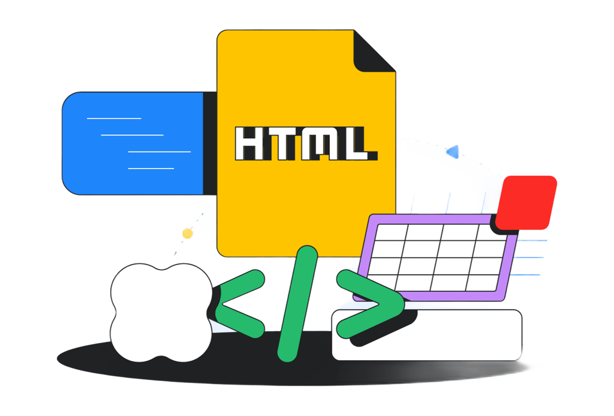

# Ruta de Aprendizaje HTML5: Semántica, Accesibilidad y Estándares Web



**Ruta práctica, moderna y orientada a proyectos para dominar la arquitectura web, accesibilidad (A11y) y estándares oficiales del W3C.**

[](https://developer.mozilla.org/es/docs/Web/HTML)
[](https://validator.w3.org/nu/)
[](https://www.w3.org/WAI/standards-guidelines/wcag/)
[](LICENSE)

---

## 🎯 Sobre este curso

Este repositorio es una guía integral, moderna y estructurada paso a paso para dominar el desarrollo web con **HTML5 contemporáneo**.

A diferencia de los tutoriales tradicionales que se limitan a memorizar etiquetas, este curso te enseñará el **modelo mental**, la **semántica estructural**, la **accesibilidad universal (WCAG)** y las buenas prácticas de arquitectura web que exige la industria del software.

> [!TIP]
> **Antes de comenzar:** Configura tu editor de código (VS Code) y las extensiones recomendadas siguiendo la guía de **[Configuración del entorno](configuracion/README.md)**.

---

## 🗺️ Ruta de Aprendizaje

El curso está organizado en **4 fases progresivas** que cubren desde los fundamentos del documento hasta el desarrollo y despliegue de proyectos profesionales:

### Fase 1: Fundamentos y Semántica Estructural

* 📄 **[01. Estructura HTML5](01-estructura-html/README.md):** El esqueleto base (`html`, `head`, `body`), DOCTYPE, modo Quirks y el Árbol DOM en DevTools.
* ✍️ **[02. Texto y Atributos](02-texto-y-atributos/README.md):** Jerarquía de encabezados (`h1`-`h6`), elementos en bloque vs. en línea, formateo semántico y atributos globales.
* 🔗 **[03. Enlaces y Listas](03-enlaces-y-listas/README.md):** Hipervínculos relativos/absolutos, accesibilidad en enlaces, listas ordenadas, desordenadas, de descripción y anidadas.
* 🧱 **[04. Agrupación Semántica](04-agrupacion-semantica/README.md):** Arquitectura y layout con `<header>`, `<nav>`, `<main>`, `<article>`, `<section>`, `<aside>` y `<footer>`.

### Fase 2: Contenido, Datos e Interactividad

* 🖼️ **[05. Contenido Embebido](05-contenido-embebido/README.md):** Optimización de imágenes (CLS), formatos modernos (WebP/SVG), `<picture>`, audio, video nativo con subtítulos e `iframe`.
* 📊 **[06. Tablas de Datos](06-tablas-de-datos/README.md):** Estructuración accesible de datos tabulares (`caption`, `thead`, `tbody`, `scope`, `colspan` y `rowspan`).
* 📝 **[07. Formularios Modernos](07-formularios-modernos/README.md):** Captura de datos, validación nativa sin JavaScript, tipos de `input`, `<datalist>`, `<fieldset>` y accesibilidad con `<label>`.
* ⚡ **[08. Elementos Interactivos](08-elementos-interactivos/README.md):** Componentes nativos como `<details>` con acordeones exclusivos, modales con `<dialog>`, `<progress>`, `<meter>` y la Popover API.

### Fase 3: Integración, SEO y Accesibilidad

* 🌐 **[09. Metadatos e Integración](09-metadatos-e-integracion/README.md):** Optimización del `<head>`, SEO técnico, tarjetas para redes sociales (Open Graph y Twitter), favicons SVG y carga de scripts (`defer`/`async`).
* ♿ **[10. Accesibilidad y Validación](10-accesibilidad-y-validacion/README.md):** Estándares internacionales WCAG, reglas de WAI-ARIA, navegación exclusiva por teclado y validación oficial del W3C.
* 🗂️ **[11. Sitio Multipágina](11-sitio-multipagina/README.md):** Arquitectura modular de carpetas, resolución de rutas relativas, `aria-current="page"` y migas de pan (*breadcrumbs*).

### Fase 4: Proyectos Reales de Integración

* 🚀 **[12. Proyecto Guiado: Landing Page SaaS](12-proyecto-guiado-landing/README.md):** Taller de ensamble construyendo una landing page real estilizada con Pico CSS basándose exclusivamente en HTML semántico.
* 🏆 **[13. Desafío Técnico Final](13-desafio-tecnico-final/README.md):** Prueba técnica autónoma de contratación: portal completo para un taller de **Alebrijes de Oaxaca** sin código de ayuda.

---

## 🔄 Metodología de Estudio: El Sistema de Dos Archivos

En casi todas las lecciones trabajarás con dos archivos para garantizar que experimentes sin miedo a romper tu proyecto final:

```text
[ index.html: EL LABORATORIO ]
- Pruebas el código de la lección paso a paso.
- Provocas errores intencionales para ver cómo reacciona el navegador.
- Inspeccionas el DOM y la accesibilidad con las DevTools (F12).
               │
               ▼
[ reto.html: EL RETO AUTÓNOMO ]
- Una hoja en blanco con una lista de requisitos del mundo real.
- Resuelves el proyecto por tu propia cuenta sin código regalado.
- Auditas tu solución con el Validador Oficial del W3C.
               │
               ▼
[ AUTOEVALUACIÓN DESPLEGABLE ]
- Validas tu comprensión con preguntas conceptuales y soluciones explicadas.
```

---

## 📁 Estructura del Repositorio

```text
guia-html/
├── assets/                         # Recursos gráficos compartidos del curso
├── configuracion/                  # Guía de instalación y entorno (VS Code + Live Preview)
├── 01-estructura-html/             # Lección 01: Esqueleto y etiquetas base
├── 02-texto-y-atributos/           # Lección 02: Jerarquía y formato de texto
├── 03-enlaces-y-listas/            # Lección 03: Hipervínculos y listas
├── 04-agrupacion-semantica/        # Lección 04: Layout semántico y landmarks
├── 05-contenido-embebido/          # Lección 05: Multimedia, imágenes y video
├── 06-tablas-de-datos/             # Lección 06: Tablas complejas y accesibles
├── 07-formularios-modernos/        # Lección 07: Formularios y validación nativa
├── 08-elementos-interactivos/      # Lección 08: Modales, acordeones y popovers
├── 09-metadatos-e-integracion/     # Lección 09: SEO, Open Graph y recursos
├── 10-accesibilidad-y-validacion/  # Lección 10: WCAG, ARIA y validador W3C
├── 11-arquitectura-multipagina/    # Lección 11: Rutas relativas y navegación
├── 12-proyecto-guiado-landing/     # Lección 12: Taller guiado con Pico CSS
├── 13-desafio-tecnico-final/       # Lección 13: Proyecto autónomo de certificación
├── LICENSE                         # Licencia de código abierto MIT
└── README.md                       # Este índice general
```

---

## 🛠️ Herramientas recomendadas

* **Editor:** [Visual Studio Code](https://code.visualstudio.com/) configurado con la extensión oficial **Live Preview** de Microsoft.
* **Navegador web:** [Mozilla Firefox](https://www.mozilla.org/es-ES/firefox/), [Google Chrome](https://www.google.com/chrome/) o [Brave](https://brave.com/) (con uso activo de las herramientas para desarrolladores `F12`).
* **Validador sintáctico:** [Nu Html Checker del W3C](https://validator.w3.org/nu/) para auditar el código de cada entrega.

---

## 📚 Documentación y Enlaces Oficiales

* 📖 [MDN Web Docs - Referencia oficial de HTML](https://developer.mozilla.org/es/docs/Web/HTML)
* 🌐 [Validador oficial Nu Html Checker (W3C)](https://validator.w3.org/nu/)
* ♿ [Iniciativa de Accesibilidad Web (WAI - W3C)](https://www.w3.org/WAI/)
* 🎨 [Pico CSS - Framework semántico sin clases](https://picocss.com/)

---

## Desarrollado por

[Hugo Frias](https://hugofriasmtz.github.io/my-portfolio/)

Gracias por tu interés en esta ruta de aprendizaje. Si encuentras errores, tienes sugerencias o quieres contribuir, no dudes en abrir un *issue* o enviar un *pull request*.

## 📄 Licencia

Este proyecto está bajo la licencia [MIT](LICENSE) © 2026 Hugo Frias. Eres libre de usarlo, compartirlo y adaptarlo para tu propio aprendizaje y enseñanza.
